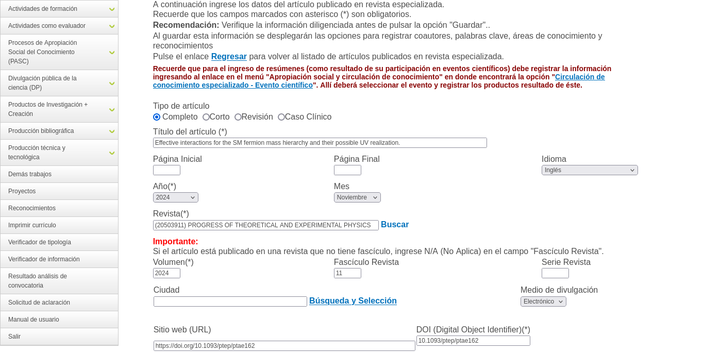

# autofillcvlac

A Python package for processing research data and automatically fill the CVLaC (Curriculum Vitae de Latinoamérica y el Caribe) information.

## Installation

```bash
pip install autofillcvlac
```

## Usage

```python
from autofillcvlac import flatten, authenticate_cvlac, fill_scientific_article, extract_scientific_article_data
from autofillcvlac.core import get_research_products, filter_products_by_year, create_products_dataframe, filter_missing_journal_articles
import getpass

# Flatten a list of lists
nested_list = [[1, 2], [3, 4], [5]]
flat_list = flatten(nested_list)
print(flat_list)  # [1, 2, 3, 4, 5]

# Get research products from Impactu API using cod_rh (Colombian researcher identifier)
# The cod_rh is the unique identifier for Colombian researchers registered in the 
# Scienti platform of MINCIENCIAS. The Impactu API (https://impactu.colav.co/) 
# provides access to research products that may be missing from researchers' CvLAC profiles.
cod_rh = '0000177733'  # Example: Colombian researcher ID
products = get_research_products(cod_rh)
    
# Filter journal articles missing in CvLAC - articles from the last 5 years 
# that are not yet registered in the researcher's Scienti profile
missing_articles = filter_missing_journal_articles(products)

# Extract data for each article to use with fill_scientific_article
for product in missing_articles:
    extracted_data = extract_scientific_article_data(product)
    if extracted_data:
        print(f"Ready to fill: {extracted_data['title']}")
        print(f"Journal: {extracted_data.get('journal_name', 'N/A')}")
        print(f"Year: {extracted_data.get('year', 'N/A')}")

# Secure credential input
documento_identificacion = getpass.getpass('documento_identificacion: ')
password = getpass.getpass('password: ')

# Authenticate with CVLaC system
auth_result = authenticate_cvlac(nacionalidad='Colombiana', nombres='John Doe', 
                                documento_identificacion=documento_identificacion, 
                                password=password, headless=False)
if auth_result['status'] == 'success':
    print("Authentication successful!")
    
    # Example 1: Fill form with extracted data from Impactu API
    # Use the first missing article found earlier
    if missing_articles:
        first_article = missing_articles[0]
        extracted_data = extract_scientific_article_data(first_article)
        
        if extracted_data:
            print(f"Filling form for: {extracted_data['title']}")
            # Fill the scientific article form using extracted data
            article_result = fill_scientific_article(**extracted_data)
            
            if article_result['status'] == 'success':
                print("Article form filled successfully!")
                # Take screenshot to show results (saved as result.png)
                from helium import get_driver
                driver = get_driver()
                driver.get_screenshot_as_file('result.png')
                print("Screenshot saved as result.png showing the filled form")
            else:
                print(f"Error: {article_result['message']}")
    
    # Example 2: Manual form filling with custom data
    article_result = fill_scientific_article(
        title="Machine Learning Applications in Healthcare",
        article_type="111",  # Completo
        initial_page="15",
        final_page="28", 
        language="EN",
        year=2023,
        month=6,
        volume="10",
        issue="2",
        publication_medium="Electrónico",
        website_url="https://example-journal.com/article/123",
        doi="10.1234/example.2023.123"
    )
    
    if article_result['status'] == 'success':
        print("Article form filled successfully!")
    else:
        print(f"Error: {article_result['message']}")
else:
    print(f"Authentication failed: {auth_result['message']}")

# Authenticate with CVLaC system for foreign nationality
auth_result = authenticate_cvlac(nacionalidad='Extranjero - otra', nombres='John Doe', 
                                documento_identificacion='dummy', password='your_password', 
                                pais_nacimiento='Estados Unidos', fecha_nacimiento='1990-05-15')
if auth_result['status'] == 'success':
    print("Authentication successful!")
else:
    print(f"Authentication failed: {auth_result['message']}")

# Get research products from API
response = get_research_products('67dc9885444bab3c3f1a7df2')
if response.status_code == 200:
    products = response.json().get('data', [])
    
    # Filter products by year
    filtered_products = filter_products_by_year(products, 2002)
    
    # Create DataFrame for analysis
    df = create_products_dataframe(filtered_products)
    print(df.head())
```



*The screenshot above shows the CVLaC interface after successfully filling a scientific article form using the `fill_scientific_article(**extracted_data)` function. The form fields are automatically populated with data extracted from the Impactu API.*

## Key Features: Impactu API Integration

This package leverages the **Impactu API** (https://impactu.colav.co/) to identify research products missing from Colombian researchers' CvLAC profiles:

- **`cod_rh`**: The unique identifier for Colombian researchers registered in the Scienti platform of MINCIENCIAS
- **Missing Product Detection**: Automatically identifies journal articles from the last 5 years that haven't been registered in CvLAC
- **Automated Data Extraction**: Converts research product metadata into CVLaC form parameters
- **Seamless Integration**: Direct workflow from API data to form filling with `fill_scientific_article(**extracted_data)`

The API provides comprehensive research data that researchers can use to keep their CvLAC profiles up-to-date with their latest publications.

## Features

- Fetch research products from the Impactu API
- Filter products by publication year and source
- **Filter journal articles missing in CvLAC** by criteria (issue #39)
- **Extract scientific article data** from research product dictionaries for CVLaC forms
- Convert research data to pandas DataFrames for analysis
- Extract citation counts from multiple sources (OpenAlex, Scholar)
- Process author information and external IDs
- Authenticate with CVLaC (Curriculum Vitae de Latinoamérica y el Caribe) system using web automation
- **Fill scientific article forms** in CVLaC with metadata including title, type, pages, language, publication details, and DOI

## Development

This package is built from research workflows originally developed in Jupyter notebooks for analyzing academic publication data from Latin American and Caribbean researchers.
